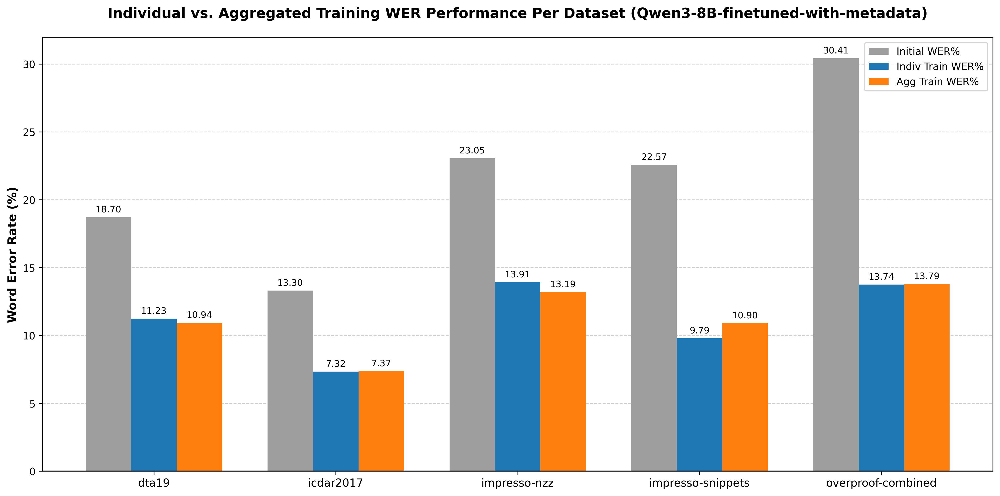
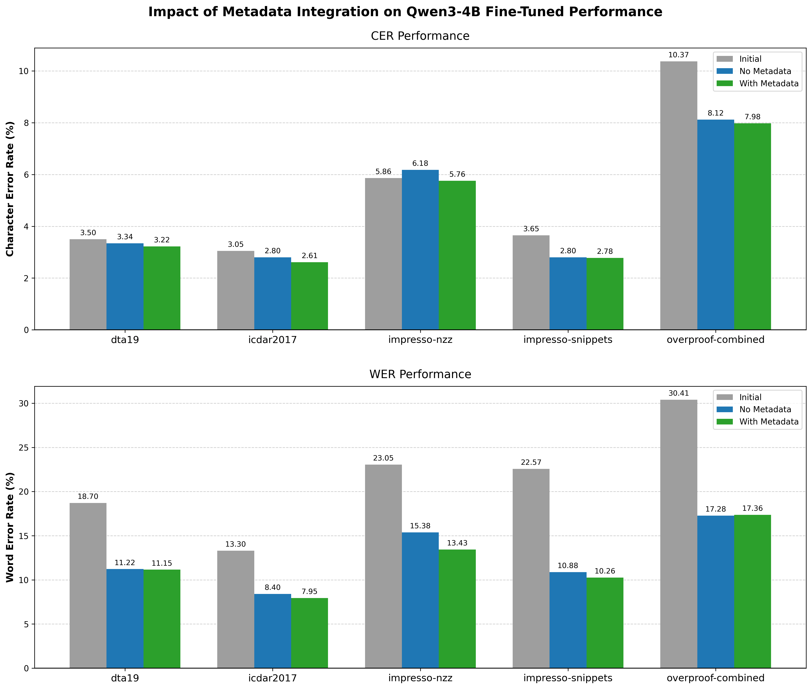

# hipe-ocrepair-llm

Abstract: 

>OCR errors are bad. Can langue models correct OCR errors? 

Short answer: **Yes**

More details:
- Can a denoising autoencoder (BART) fix OCR errors? : **NO**
- Can modern LLMs like Qwen3 do that? : **Absolutely, but it depends**
    - Zero-shotting and prompt engineering? **NO**
    - Fine-tuning? **YES**
    - Does injecting metadata of the document into the prompt help? **EVEN BETTER**

This repo contains experiment set up, scripts, results and findings.

```bash
.
├── data                                # Preprocessed data for fine-tuning
│   ├── datasets                        # Split by dataset name
│   ├── hipe_aggregated_dev.parquet     
│   ├── hipe_aggregated_test.parquet    # Combination of all 5 datasets
│   ├── hipe_aggregated_train.parquet   
│   └── languages                       # Split by language: English, French, German
├── findings.md                         # Some of my interesting findings xD
├── finetune                            # Fine tune scripts + configs
│   ├── bart.py
│   ├── config.yaml
│   ├── qwen3_but_better.py             # Longer + detailed prompt
│   └── qwen3.py
├── finetune-logs                       # Finetune logs
├── LICENSE
├── main.py
├── model_eval                          # Model evaluation scripts
│   ├── evaluate_bart.py
│   ├── evaluate_pleias.py
│   ├── evaluate_qwen_better.py         # Longer + detailed prompt
│   ├── evaluate_qwen.py
│   ├── metrics.py                      # Calculate CER, WER
│   └── split_metrics.py
├── model_eval_logs                     # Model evaluation logs
├── pyproject.toml
├── README.md                           # Definitely not this file
├── report                              # My report in LaTeX
├── scripts
│   ├── convert_to_jsonl_splits.py      # Convert parquet to jsonl for official scorer
│   ├── data_aggregation.py             # Combine data into hipe_aggregated
│   ├── data_split_by_dataset.py        # Split by dataset
│   ├── data_split_by_language.py       # Split by language
│   ├── download_dataset.sh             # Download official HIPE-OCRepair 2026 benchmark
│   ├── evaluate_bart_slurm.sh          # Evaluate experiments BART
│   ├── evaluate_official_scorer.sh     
│   ├── evaluate_qwen_slurm.sh          # Evaluate experiments Qwen3
│   ├── fine_tune_bart_slurm.sh         # Finetune experiments BART
│   ├── fine_tune_qwen_slurm.sh         # Finetune experiments Qwen3
│   └── generate_hypotheses.py
├── src
│   ├── bart_base_ocr.py                # Some random temporary code snippets
│   ├── facebook_bart_base.py
│   ├── grab_samples.py
│   └── metrics.py
└── uv.lock
```


## 1. Set up & Install dependencies

For this project, I'll be using `uv` which is a pieton package manager but better than conda, it uses oxidized iron (rust) to speed up packages download lmao.

Install `uv` with:

```bash
curl -LsSf https://astral.sh/uv/install.sh | sh
```

Then sync (download) with my dependencies in `pyproject.toml`:

```bash
uv sync
```

Note: This is gonna download `pytorch`, it will take a while and **A LOT OF DISK SPACE**, if you have `pytorch` installed elsewhere, use it instead xD.

Optional: Afterwards, you'll see the folder `/.venv/`, you can activate this virtual env with 
```bash
source .venv/bin/activate
which python #should say ...hipe-ocrepair-llm/.venv/bin/python
```
Or if you dislike it, then you'll need to add `uv run` in front of every commands below. Example: `python src/grab_samples.py` --> `uv run python src/grab_samples.py`

## 2. Download dataset: HIPE-OCRepair-2026-data

Download the dataset first:
```bash
chmod +x ./scripts/*
./download_dataset.sh
```

## 3. Grab samples from dataset

This script will let you see the differences between curated ground truth text and ocr text.

```bash
python src/grab_samples.py
```

## 4. BART Finetune and Eval

I run my experiments on the university's SLURM cluster, which uses some magic to assign job to a node with GPU. Then bam, I get my result.

Go to [./scripts/fine_tune_bart_slurm.sh](./scripts/fine_tune_bart_slurm.sh), uncomment or copy the expierment we want to run, then hit:
```
sbatch scripts/fine_tune_bart_slurm.sh
```
The log or standard output should be streaming in the file `./finetune-logs/bart-ft-%j.log`

Same logic for evaluation, go to [./scripts/evaluate_bart_slurm.sh](./scripts/evaluate_bart_slurm.sh), uncomment the desired experiment then hit:
```
sbatch scripts/evaluate_bart_slurm.sh
```
Result is in `model_eval_logs/bart-eval-%j.log`

## 4. Qwen3 Finetune and Eval

Go to [./scripts/fine_tune_qwen_slurm.sh](./scripts/fine_tune_qwen_slurm.sh), uncomment or copy the expierment we want to run, then hit:
```
sbatch scripts/fine_tune_qwen_slurm.sh
```
The log or standard output should be streaming in the file `./finetune-logs/qwen-ft-%j.log`

Same logic for evaluation, go to [./scripts/evaluate_qwen_slurm.sh](./scripts/evaluate_qwen_slurm.sh), uncomment the desired experiment then hit:
```
sbatch scripts/evaluate_qwen_slurm.sh
```
Result is in `model_eval_logs/qwen-eval-%j.log`

## 5. Some interesting charts





## Google sheet link for experiment tracking: 
[Here](https://docs.google.com/spreadsheets/d/1RFEZXg5q-4pkao0pQvJn3HQheoMqu051YjwCMMazEto/edit?usp=sharing)

## Nothing to see down here, just some of my helper scripts

Rsync from local machine to l3icalculmaster:
```bash
rsync -avz ~/Desktop/hipe-ocrepair-llm mtran01@l3icalculmaster:/Utilisateurs/mtran01/ --exclude={'.venv/*','.venv','uv.lock','.git','.git/*'}
```

l3icalculmaster to local machine:
```bash
rsync -avz mtran01@l3icalculmaster:/Utilisateurs/mtran01/hipe-ocrepair-llm/ ~/Desktop/hipe-ocrepair-llm/ --exclude={'.venv/*','.venv','model','model/*','scripts/data_aggregation.py'}
```

